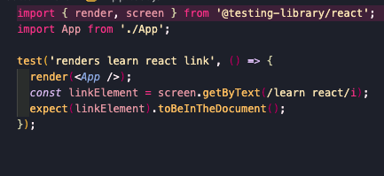

# Jest 및 테스팅 라이브러리로 React 테스트하기

## Section 1

### React Testing Library(RTL)

- RTL은 테스트를 위한 가상 DOM을 제공한다.

### Jest

- Test runner이다.
  - 테스트를 찾고 실행하며 단언한다.
- 테스트를 찾고 실행하는 것과 테스트 통과 여부를 결정한다.

### 테스팅 라이브러리를 사용한 첫번째 테스트

`npm test` : Jest에서 Watch 모드 실행으로 시작된다.



#### render

- render 함수는 전달받은 인수로 JSX에 관한 가상 DOM을 생성한다.
  - 여기서 JSX에 관한 인수는 app 컴포넌트이다.
- 렌더링된 가상 DOM에는 어떻게 액세스할까?
  - screen global 객체로 액세스한다.

#### screen.getByText()

- 표시되는 모든 텍스트를 기반으로 DOM에서 요소를 찾는다.

#### /learn react/i

- 여기서 getByTest의 인수는 정규 표현식이다.
- 문자열을 대신 넣을 수도 있다.

#### expect().toBeInTheDocument()

- 단언하는 부분
- 테스트 성공과 실패의 원인이다.
- 테스트 통과 여부를 결정한다.

### Jest: Watch 모드와 테스트가 작동하는 방식

#### Watch 모드

- Jest를 실행하는 방법
- 마지막 커밋 이후 파일의 모든 변경 사항을 확인해서, 마지막 커밋 이후 변경된 파일과 연관된 테스트만 실행한다.

```javascript
test('test를 식별하는 문자열', () => {
  '테스트를 결정하는 콜백함수';
  '에러가 발생하면 테스트 실패';
});
```

### TDD(Test-Driven Development)

- 코드 작성 전에 테스트를 작성하고, 테스트에 통과하도록 코드를 작성하는 것
- red-green testing
  - 코드 작성 전에는 실패 테스트 코드를 작성하고
  - 코드 작성 후에는 성공 테스트 코드를 작성하는 방법

#### Why TDD?

- 테스트를 작성하는 것이 프로세스의 한 부분으로 느끼는 방식에 차이가 있기 때문이다.
  - 마지막에 해야하는 일이 아닌, 코딩 프로세스의 일부이다.
- 효율적이다.
  - 원하는대로 작동하는지 확인하면서 소프트웨어를 업데이트할텐데, 이는 수동 업데이트이다.
  - 하지만 코드 작성 전에 테스트를 작성하면, 변경 후에 자동으로 다시 실행할 수 있다.
    **그래서 개발할 때마다 테스트 코드를 작성하면, 변경사항이 생길 때마다 모든 테스트를 다시 실행해서 자동 회귀 테스트를 할 수 있다.**
    -> 변경 사항 확인을 위해 애플리케이션을 열고 수동으로 테스트할 필요가 없다.

### React Testing Library 철학

#### RTL의 역할과 사용 이유

- RTL은 테스트를 위한 가상 DOM을 만들어주고, DOM과 상호 작용하기 위한 유틸리티 제공
  - DOM에서 요소를 찾을 수 있거나 클릭과 같은 요소와 상호 작용할 수 있다.
- 브라우저 없이도 테스트가 가능한다.

### Test 종류

- Unit tests(유닛 테스트)
  - 함수나 컴포넌트 코드의 한 유닛 혹은 단위를 테스트
  - 서로 상호작용하는 것을 테스트하지 않는다.
- Integration tests(통합 테스트)
  - 여러 유닛이 함께 작동하는 방식을 테스트
  - 유닛 간의 상호 작용을 테스트한다.
- Functional tests(기능 테스트)
  - 소프트웨어의 특정 기능을 테스트
  - 특정 코드 함수가 아닌 소프트웨어의 일반적인 동작을 의미한다.
  - 일반적인 동작 : 데이터를 폼에 입력하고 제출을 클릭하면 소프트웨어가 특정 데이터 set으로 바르게 작동하는 기능을 확인해야 한다.
  - 코드가 아닌 동작을 테스트하는 것이다.
- End-to-end Tests(E2E 테스트)
  - 이 테스트는 실제 브라우저와 애플리케이션이 연결된 서버가 필요하다.
  - Cypress나 Selenium과 같은 특별한 도구가 필요

### 유닛 테스트와 기능 테스트

#### 유닛 테스트

유닛 테스트는 테스트를 최대한 격리시킨다.

그래서 함수나 컴포넌트를 테스트할 때, 의존성을 표시한다.

- 장점 : 실패 원인을 파악하기 매우 쉽다.
- 단점1 : 사용자가 소프트웨어와 상호 작용하는 방식과는 거리가 멀다.
- 단점2 : 리팩토링을 실패할 수도 있다.
  - 리팩토링은 동작은 동일하되,코드를 변경하는 것이므로

#### 기능 테스트

- 테스트하는 특정 동작이나 유저 플로우와 연관된 모든 단위를 포함한다.
- 장점1 : 사용자가 소프트웨어와 상호 작용하는 방식과 밀접하다.
- 장점2 : 테스트가 견고하다.
  - 리팩토링을 할 때, 동작이 동일하게 유지되는 한 테스트도 통과한다.
- 단점 1 : 실패할 테스트를 디버깅하기 어렵다.
  - 어떤 부분의 코드가 실패의 원인인지 파악하기 힘들다.

### TDD(테스트 주도 개발) vs BDD(행동 주도 개발)

- Testing Library는 행동을 테스트하는 것을 장려한다.
- 그럼 우리는 TDD 대신 BDD라고 불러야는는걸까?
  - No
- BDD는 명확히 정의되어있다.
  - 개발자, QA, 비즈니스 관계자 등 다양한 역할 간의 상호작용도 포함한다.
  - 다양한 그룹들간의 상호작용 과정을 정의한다.
- 우리는 오직 개발자만 있으므로, TDD라고 부른다!ㄴ

### 테스팅 라이브러리와 접근성

`getByRole` : 첫번째 인수는 역할 그 자체, 두 번째는 옵션

```javascript
const linkElement = screen.getByRole('link', { name: /learn react/i });
```

- 만약 스크린 리더가 찾을 수 있는 요소가 발견되지 않는다면?
  - 우리의 애플리케이션이 스크린 리더에 친화적이지 않음을 의미하므로, 시맨틱 태그를 활용해야함

## Section 2 : 간단한 앱으로 테스트하기

### Color Button 앱 시작하기

test에 들어갈 인수는 테스트를 설명하는 문구와 테스트를 실행할 함수이다.

해당 함수가 오류를 반환하지 않으면 테스트를 통과한 것이다.

1. render할 컴포넌트를 불러온다.
2. screen 이라는 전역 객체에 접근하여 `getByRole`를 호출한다.
3. getByRole의 첫번째 인자에는 역할, 두번째 인자에는 확인할 옵션을 넣는다.
4. expect와 matcher 함수를 활용해 테스트한다.

```javascript
test('button has correct initial color', () => {
  render(<App />);
  const colorButton = screen.getByRole('button', { name: 'Change to Blue' });

  expect(colorButton).toHaveStyle({ backgroundColor: 'red' });
});
```

5. 에러 발생

```bash
    TestingLibraryElementError: Unable to find an accessible element with the role "button" and name "Change to Blue"
```

6. App.jsx 버튼 컴포넌트 생성 및 재테스트 결과

```javascript
function App() {
  return (
    <div>
      <button style={{ backgroundColor: 'red' }}>Change to Blue</button>
    </div>
  );
}
```

```bash
 PASS  src/App.test.js
  ✓ button has correct initial color (73 ms)
  ✓ button turns blue when clicked

Test Suites: 1 passed, 1 total
Tests:       2 passed, 2 total
Snapshots:   0 total
Time:        0.666 s, estimated 1 s
Ran all test suites.
```

### Roles 디버깅을 위한 'logRules' 방식

컴포넌트 내에 역할들이 많아 구분이 필요할 때, 다음과 같이 해당 컴포넌트 내 역할을 불러올 logRules 메서드로 호출하여 확인하면 된다.

```javascript
test('button has correct initial color', () => {
  const { container } = render(<App />);
  // 역할들 로그 확인하기
  logRules(container);

  const colorButton = screen.getByRole('button', { name: 'Change to Blue' });

  expect(colorButton).toHaveStyle({ backgroundColor: 'red' });
});
```

### 버튼 클릭 시 테스트 행동(Test Behavior when Clicking Button)

기능 테스트에서는 일련의 동작을 테스트하므로, 모든 동작이 같은 테스트에 있어야 한다.

동작 사이에 단언문(expect)이 들어갈 수도 있다.

#### fireEvent

이 객체는 가상 DOM에서 요소와 상호 작용할 수 있도록 도와준다.

```javascript
test('button has correct initial color', () => {
  render(<App />);

  const colorButton = screen.getByRole('button', { name: 'Change to Blue' });

  // expect the background color to be red
  expect(colorButton).toHaveStyle({ backgroundColor: 'red' });

  // click button
  fireEvent.click(colorButton);

  // expect the background color to be blue
  expect(colorButton).toHaveStyle({ backgroundColor: 'blue' });

  // expect the button text to be "Change to Red"
  expect(colorButton).toHaveTextContent('Change to Red');
});
```

아직 기능 구현이 안되어 있으므로, 에러 발생

```bash
 FAIL  src/App.test.js
  ✕ button has correct initial color (83 ms)
  ✓ button turns blue when clicked (13 ms)

  ● button has correct initial color

    expect(element).toHaveStyle()

    - Expected

    - backgroundColor: blue;

      14 |
      15 |   // expect the background color to be blue
    > 16 |   expect(colorButton).toHaveStyle({ backgroundColor: 'blue' });
         |                       ^
      17 |
      18 |   // expect the button text to be "Change to Red"
      19 |   expect(colorButton).toHaveTextContent('Change to Red');
```

- 에러 문장을 보았듯이, 단언문의 테스트가 실패시, 이후 테스트는 실행되지 않는다.

### React 코드 : 버튼을 클릭하여 색상 변경하기

### 수동 인수(Acceptance) 테스트

### 버튼과 체크박스의 초기 조건 테스트

### 가져온(Import) CSS 모듈에서 스타일 테스트하기

### 코드 퀴즈! 체크박스 체크 시 확인 버튼 비활성화
